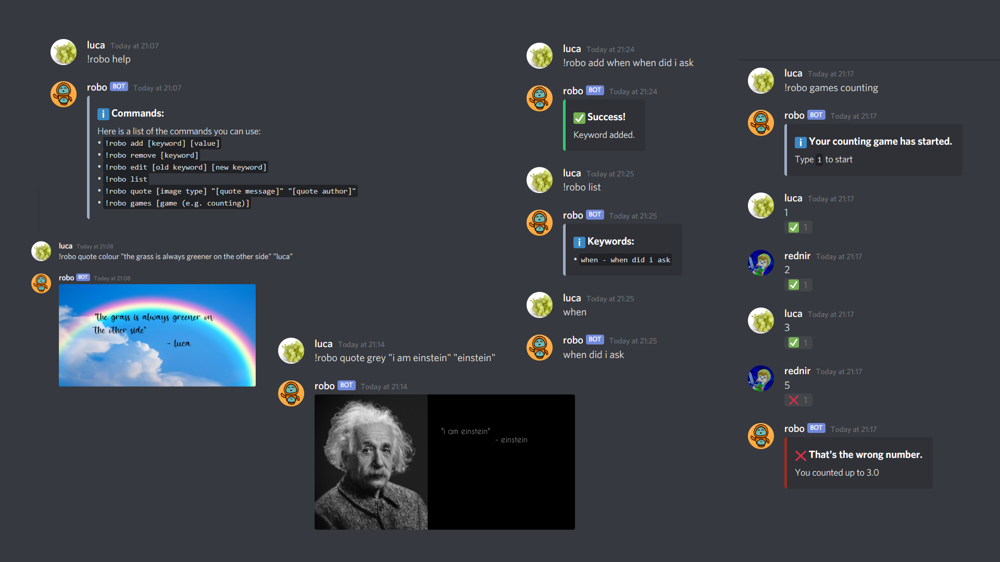

# Robo
A Discord bot written in Python using the Discord.py library.

## Using the bot
Link to invite the bot to a server:
 - https://discord.com/api/oauth2/authorize?client_id=824340926100799538&permissions=8&scope=bot

Once the bot has joined, you can type `!robo help` in any text channel to view a list of commands.

### What can it do?
Stuff

## Hosting the bot yourself
Download the executable from the [releases page](https://github.com/lucaadams/robo)

To host the bot, you must have a bot token. Make sure you have created an application [here](https://discord.com/developers/applications), and added a bot user to it with sufficient privileges.
